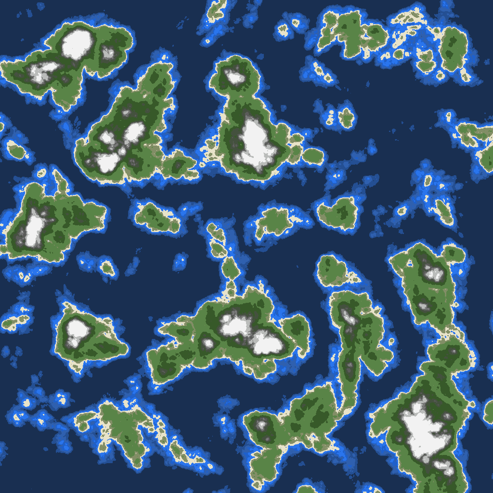
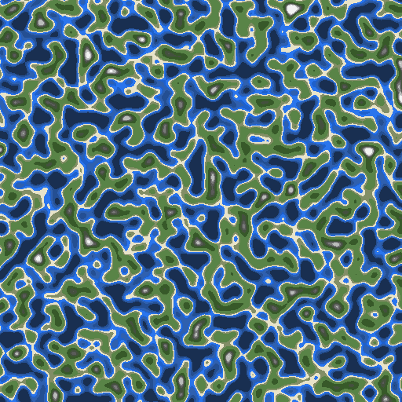
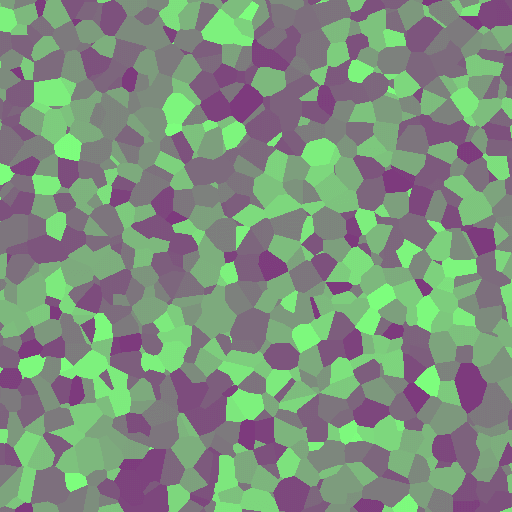

# LibNoise C# - .NET Core

A C# port from C++ [libnoise](http://libnoise.sourceforge.net/). Almost all modules have been ported, I am working on some changes from the original library, but the goal is to keep the same algorithms, only changing some features like the pipeline between the modules. It is an incomplete project.

There are other libraries but my intention here is to be compatible with the C++ library and learn some of the algorithms.

I am finishing the basic port and after this, I will polish features and add tests.

** Work-In-Progress **

## Requirements
- [.NET Core](https://github.com/dotnet/core)

## Examples
There are some examples inside the **libnoise-demo** project folder, I will make a better demo after finishing the port.

For running the demo, go and install the [.NET Core CLI](https://docs.microsoft.com/en-us/dotnet/core/tools/?tabs=netcore2x) and run the command inside the folder:

```sh
dotnet build
dotnet run
```

## Some Images





## LICENSE
[LGPL-2.1](LICENSE)

